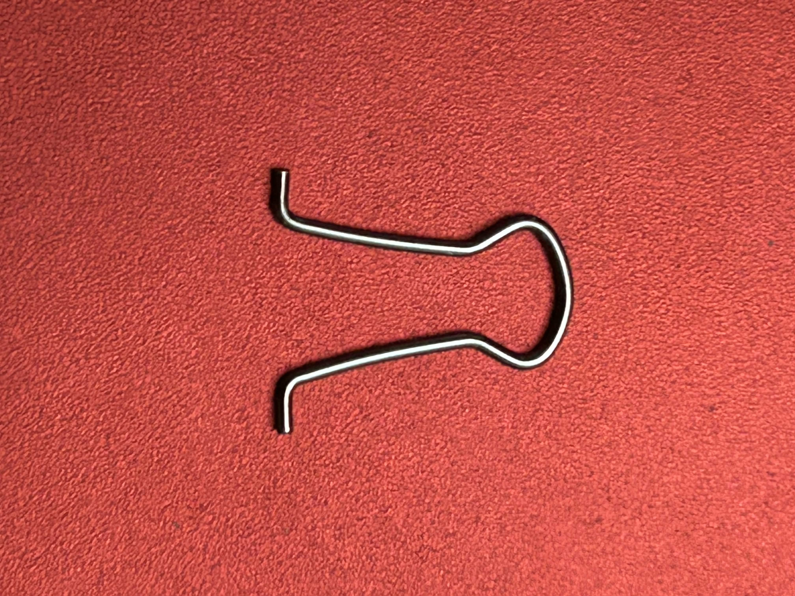
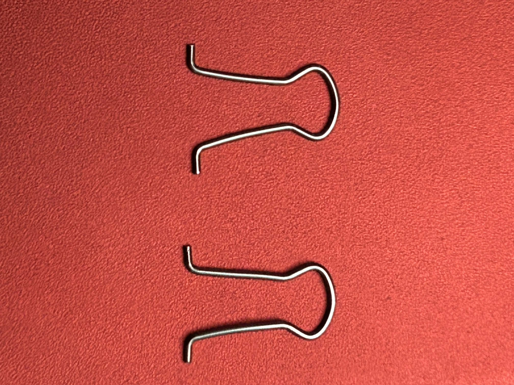
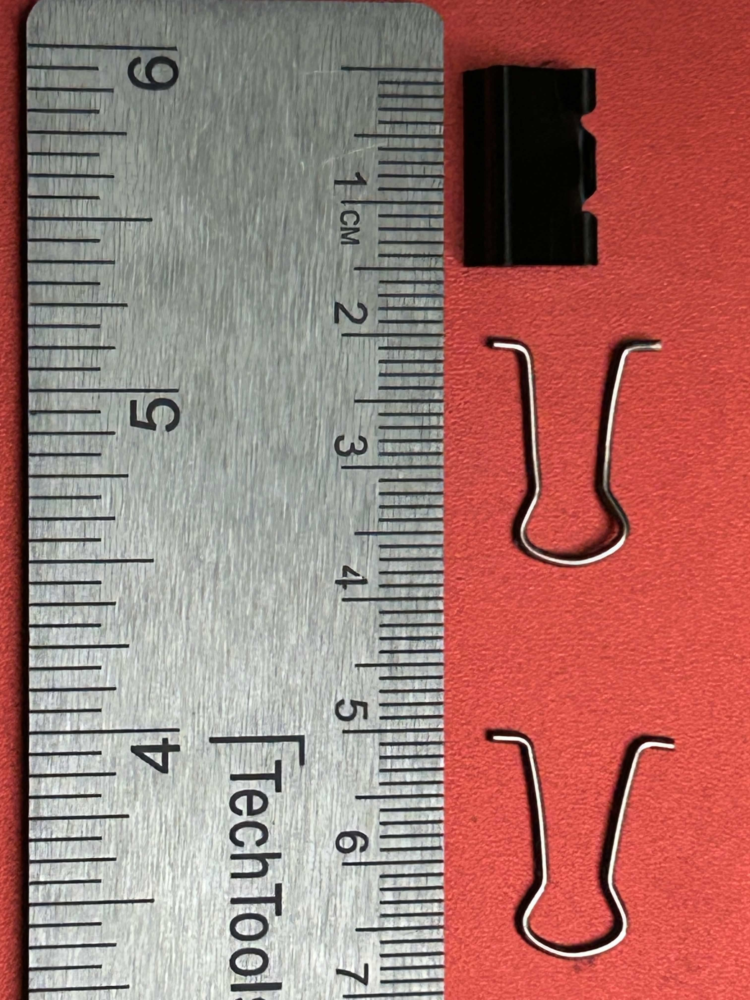
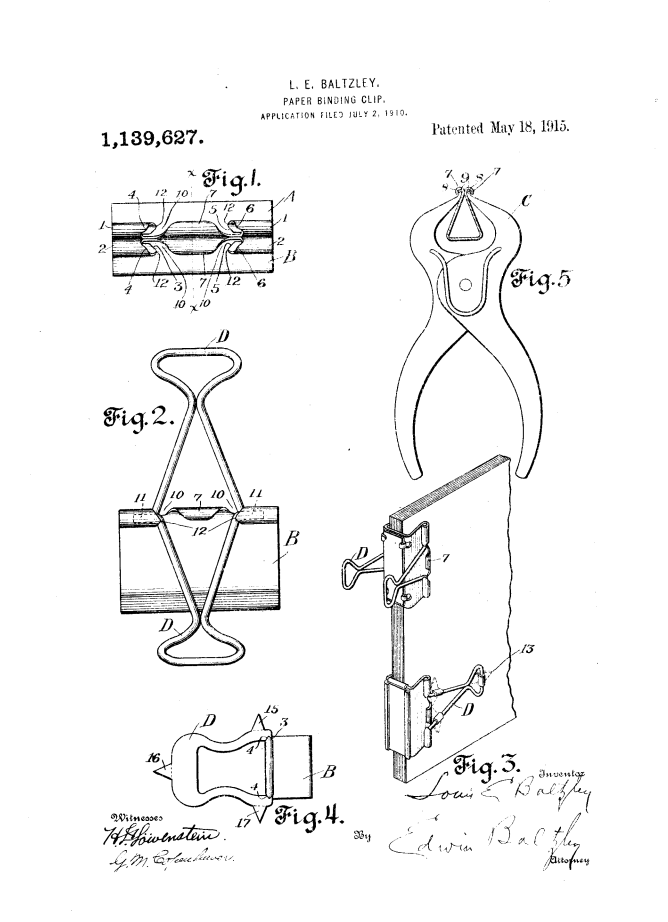

# A1 – [Topic]

## Objective
The purpose of this assignment is to build and practice the ability to clearly communicate engineering decisions, methods, and results through the development and evaluation of an engineering portfolio. It also introduces how to structure and organize a portfolio so that engineering work is documented effectively, providing experience that can later be applied to creating and maintaining a professional portfolio.

## Analyze
**Portfolio Analysis**

[github.com/jasondetaylor](https://github.com/jasondetaylor/Mechanical_Engineering_Design_Portfolio)

Initially, the portfolio is relatively easy to navigate because all of the projects are presented within a simple GitHub repository. A reader can quickly scan through the available projects and locate a specific example of the author’s engineering work without having to move through multiple pages or menus.

Unfortunately, while the projects provide short descriptions of the engineering problem and the resulting design, the portfolio lacks enough technical documentation for the work to be independently reproduced. Detailed calculations, CAD files, drawings, dimensions, component specifications, and step-by-step procedures are generally not included. Because of this, another engineer would likely need to ask additional questions before attempting to recreate the work. The portfolio does show some evidence of engineering reasoning, such as explaining how certain design constraints influenced component selection, but most of this reasoning is summarized rather than shown in detail.

Additionally, it should be noted that the portfolio utilizes an extremely simple design layout. As it is being hosted by GitHub, the emphasis is put more on the descriptions rather than on the design elements. The portfolio is thus very efficient, but not visually appealing like a personal portfolio website would be.

Overall, the portfolio proves itself efficient when used for giving a brief overview of the engineering experience of the author, but not so much for creating an engineering record. Detailed information on calculations, design choices, tests conducted, and file data should be provided for reproducing the project by another engineer.

[richardredpath.com](http://richardredpath.com/resume/redpath.html)

The navigability of Richard Redpath’s portfolio is poor since there is much information about projects, patents, and his experience in one webpage. Even though the sections have names, it can take a reader more than 60 seconds to find what he wants without the prior knowledge of the portfolio organization.

Speaking of reproducibility, there are numerous technical descriptions about software, tests, algorithms, and design constraints; however, there is not enough information that would allow another engineer to reproduce the work without making any questions regarding the process.

There is a great deal of engineering judgment provided through the portfolio. In many cases, the project description provides the problem that had to be solved and constraints that influenced the design. The testing methods and technical requirements are mentioned, and this allows the reader to understand the process of design creation.

Language used is mostly appropriate to be reviewed by an employer for evaluation of technical experience since it uses engineering language and technical achievements. However, there are some informal comments and grammatical errors, which do not contribute to the appropriateness of language in the engineering document.

In general, the portfolio shows a lot of technical experience and explains why certain decisions were made in engineering. The weaknesses are slow navigation and lack of documentation for reproduction of most of the projects.

**Product Analysis**

**Chosen Product:** Binder Clip

**a)** The primary mechanical function of the binder clip is to apply a compressive clamping force to a stack of thin sheet material using elastic deformation of a spring-steel body, while allowing the clamping jaws to be opened manually through lever-operated handles.

**b)** The governing model used in the Binder Clip is Hooke's Law:

**F=kδ**

**F** being the clamping force produced by the spring body, **k** as the effective spring stiffness of the folded steel body, and **δ** serving as the elastic displacement of the jaws from their unloaded position.

**c)** Components and Photographs

**Component 1 - Spring Steel Body:**
The body is made of a piece of spring steel which has been folded into a shape that resembles a triangle with two opposing jaws. The converging sides of the body accumulate elastic energy when the jaws are opened up. The geometry of the structure leads to generation of a reactive force by the material which tries to bring the edges of the jaws together.

**Component 2 - First Wire Handle:**
The handle is made by bending metal wires in the form of an elongated loop. By lengthening the lever arm, there is a decrease in the force applied by the user in order to deform the body of the spring and cause the jaws to open. The bent ends of the handle fit into the curved portions of the clip body.

**Component 3 - Second Wire Handle**
The second handle has the same geometry on the opposite side of the clip. Thus, the two handles can be used to apply approximately symmetric forces on both sides of the spring-steel body resulting in separation of the jaws while minimizing twisting of the clip.

**Disassembled Binder Clip with Measurements** 

**d)** Patent Research

[https://patents.google.com/patent/US1139627A/en](https://patents.google.com/patent/US1139627A/en)

The relevant original patent is US 1,139,627 A, "Paper-Binding Clip," invented by Louis E. Baltzley. Baltzley's patent describes a resilient sheet-metal body with converging sides and operating handles used to spread the jaws against the elastic resistance of the metal. The patent specifically discusses using the handles to obtain substantial leverage.

Alternative devices that perform similar primary mechanical function are:

**Paper Clip** - uses elastic deformation of bent wire to generate normal force against the sheets of paper.
**Spring Clamp** - uses a spring-loaded pair of jaws to generate compressive force on the material placed between them.

The use of long wire handles increases the moment arm between the user's applied force and the pivot point of the handle. This allows the relatively stiff spring-steel body to be deformed using a smaller hand force. The wire construction also provides this mechanical advantage with little additional material or mass.

## Decide

**Homepage Identity**
First, the primary objective of this portfolio is to show what assignments and course work have been completed within MEGR 2157. The audience for this portfolio includes graders and other students who might be looking for examples from the class, so the portfolio homepage should focus on the course, the course assignments, and the organization of the portfolio rather than personal information about the author. This will enable a visitor to immediately understand the contents and structure of the portfolio.

**One Intentional Customization**
I have intentionally customized the look of my portfolio by changing the color scheme from the default green and white combination to blue and white colors. By doing so, I created a more neutral and restrained design that makes sure that the focus of the user is on the technical content of the portfolio rather than on the portfolio interface itself, along with creating a more professional tone compared to the playful green while still retaining a developmental feel.

**Your Documentation Standard**
I will maintain the standard of ensuring that each part of the portfolio is completed and updated in a timely manner, along with ensuring that I document all the assignments by organizing the data in such a way that the engineering analysis, methods, and results can be understood.
## Communicate

Populated About Me section
