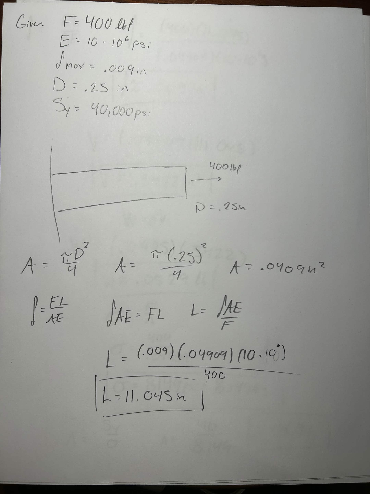
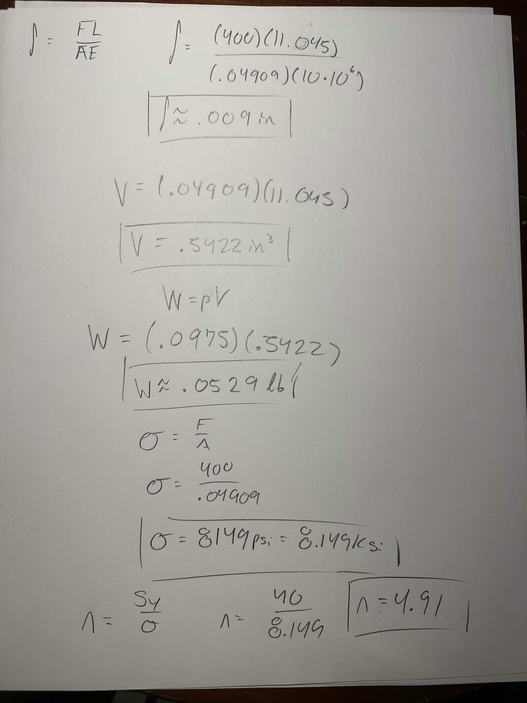
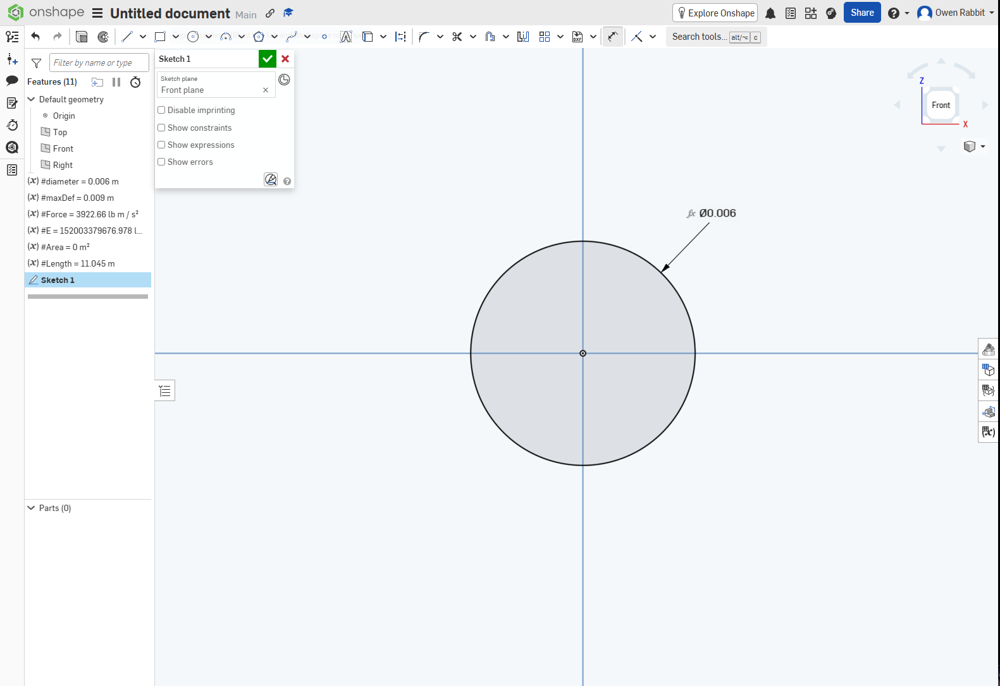
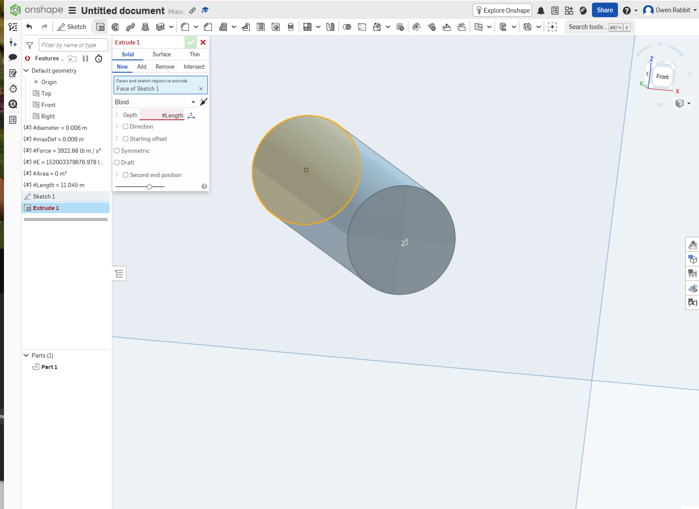
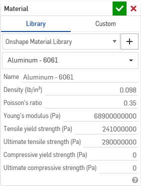
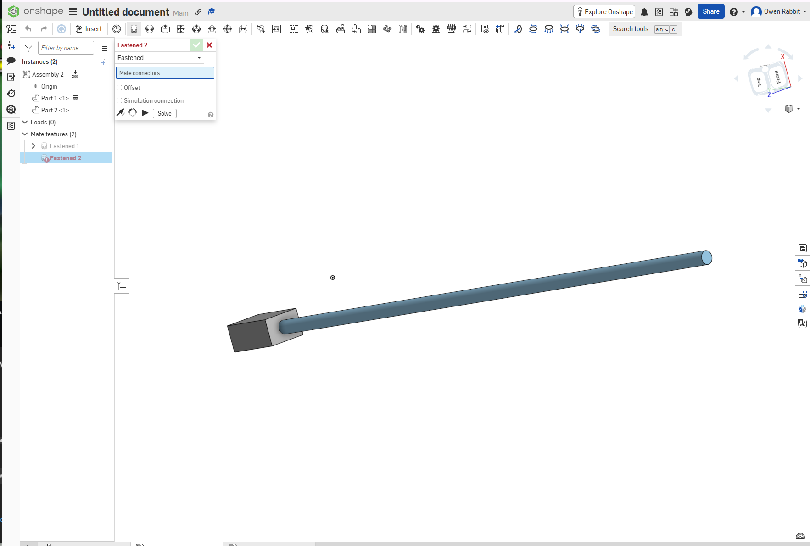
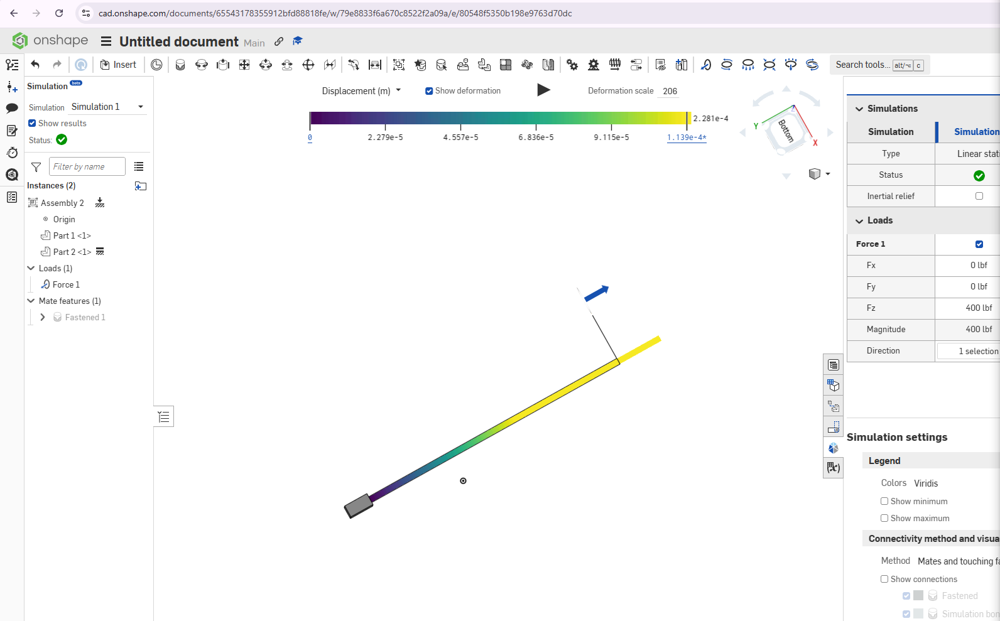
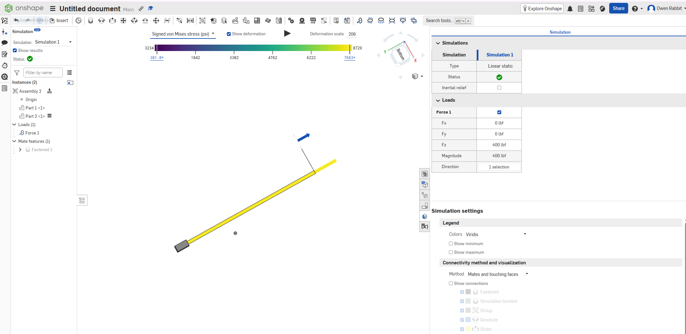
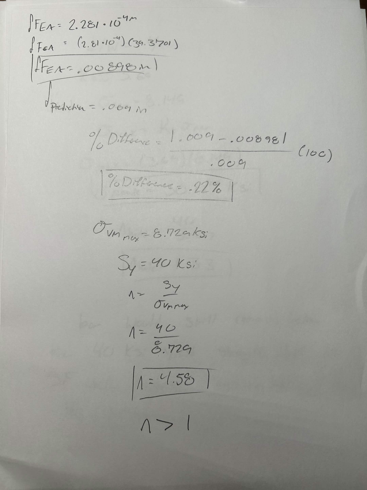
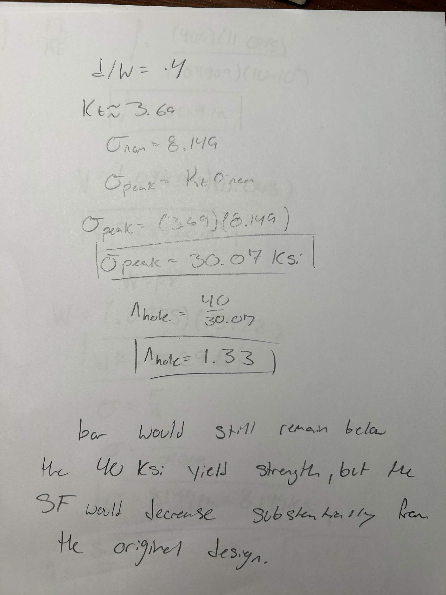

# A3 – [Parametric Design and Finite Element Analysis]

## Part 1 - Parametric Design

The purpose of this assignment was to parametrically design an aluminum bar under direct tension and verify the design using finite element analysis. I selected an applied force of 400 lbf, a maximum axial deflection of 0.009 in, a diameter of 0.250 in, and a Young's modulus of approximately 10 x 10^6 psi.

Using the direct tension elongation equation, I calculated the required length of the bar to be approximately 11.045 in. The calculated cross-sectional area was 0.04909 in^2 and the approximate weight of the bar was 0.0529 lb.

### Hand Calculations

The first portion of my hand calculations shows the selected design criteria and the calculation of the circular cross-sectional area. I then rearranged the direct tension elongation equation to solve for the required length of the bar.

I verified that the calculated geometry produced an axial deflection of approximately 0.009 in. I also calculated the volume, weight, nominal axial stress, and an initial theoretical safety factor.

## CAD Model

I created the bar using Onshape rather than Creo Parametric, which is the CAD software I normally use. The model was created parametrically so that the dimensions were controlled by variables rather than independent numerical dimensions.

The diameter, applied force, maximum deflection, Young's modulus, area, and length were established as variables. The length was determined parametrically using the relationship derived from the axial deflection equation.

The circular profile was extruded using the calculated length variable. This allows the geometry to automatically update if one of the design parameters is changed.

### Material

Aluminum 6061 was assigned to the bar in Onshape. Its Young's modulus of 68.9 GPa is approximately 10 x 10^6 psi and therefore closely matches the modulus used in the hand calculation. For the required safety factor comparison, the assignment-specified yield strength of 40 ksi was used.

## Part 2 - Finite Element Analysis

### Simulation Setup

Because Onshape performs its structural simulation from an assembly, a support component was added at the left end of the bar. The support was fixed and the bar was fastened to it to represent the fixed boundary condition shown in the assignment.

A tensile force of 400 lbf was applied along the longitudinal axis of the bar at the opposite end.

### Deflection Map

The FEA predicted a maximum displacement of 2.281 x 10^-4 m, which converts to approximately 0.00898 in. The displacement increased from approximately zero at the fixed end to its maximum at the loaded end, as expected for a uniform bar under direct tension.

### von Mises Stress Map

The maximum von Mises stress reported by the FEA was approximately 8729 psi, or 8.729 ksi. This is below the specified aluminum yield strength of 40 ksi.

The resulting safety factor is:

Safety Factor = 40 ksi / 8.729 ksi = 4.58

Therefore, the bar passes the yield-strength requirement.

## Part 3 - Design Reflection

The hand calculation predicted an axial deflection of 0.00900 in, while the finite element analysis predicted approximately 0.00898 in. The percent difference between the two methods was approximately 0.22%.

The two results are essentially the same because the bar has a constant circular cross section, the loading is purely axial, and there are no geometric stress concentrations in the original design. The analytical equation closely represents the physical conditions simulated by the FEA.

For this simple geometry, I would trust the analytical axial-deflection calculation slightly more for the overall deflection because it directly represents the ideal uniform axial loading case without mesh or boundary-condition effects. FEA becomes more useful when the geometry or loading becomes more complicated.

### Stress Concentration

For the hypothetical pin-hole analysis, I assumed a substantial centered circular hole with d/W = 0.40. A stress concentration factor of approximately Kt = 3.69 was used from stress-concentration data based on Peterson's charts.

Using the nominal stress of approximately 8.149 ksi:

Peak Stress = (3.69)(8.149 ksi) = 30.07 ksi

The resulting safety factor would be approximately:

Safety Factor = 40 ksi / 30.07 ksi = 1.33

The bar would therefore still remain below the specified yield strength, although the hole would substantially reduce the safety factor.

## Lessons Learned

This assignment helped me understand how analytical calculations, parametric CAD, and finite element analysis can be connected in one design process. One of my main difficulties was learning the workflow in Onshape because I normally use Creo Parametric. I had to learn how Onshape handles variables, assemblies, mates, materials, and simulation.

Another issue I encountered was selecting the correct aluminum material and making sure its elastic modulus agreed with the value used in my hand calculations. After correcting the material properties, the FEA deflection became very close to the analytical result. This demonstrated how important consistent material properties are when comparing analytical and numerical models.

The total time required to complete this assignment was around 4 hours.

## CAD File

[Onshape File Download](https://drive.google.com/file/d/1qUV6JAnXO_b01NbLjBC5tA4XX9e6t7i4/view?usp=sharing)

[View the Onshape Model](https://cad.onshape.com/documents/65543178355912bfd88818fe/w/79e8833f6a670c8522f2a09a/e/eb89c2f069f6aa6a332461c8?renderMode=0&uiState=6a9fae12806dd6c8e924c54f)
