# A4 – [Motor Mount Design]

## Objective

The purpose of this assignment was to design a motor mount for the specified 24 V DC planetary gear motor. The mount was designed for both yield strength and a maximum deflection of 0.30 mm using a safety factor of 3.

PLA was selected as the material. The calculations resulted in a final uniform mount thickness of **11 mm**.

---

# Feature 1

## Free Body Diagram and Calculations

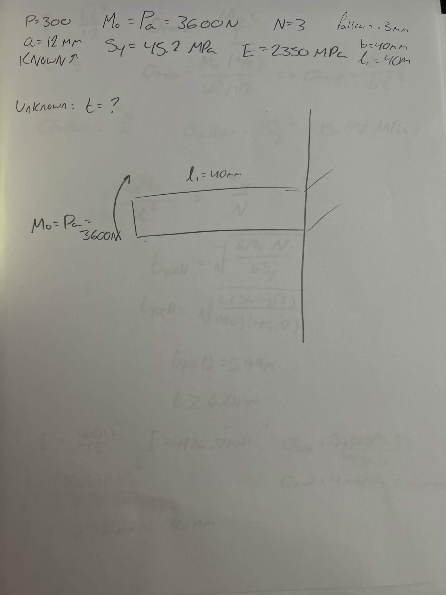

Feature 1 was modeled as a cantilever beam supporting the motor. The effective beam length used was 40 mm.

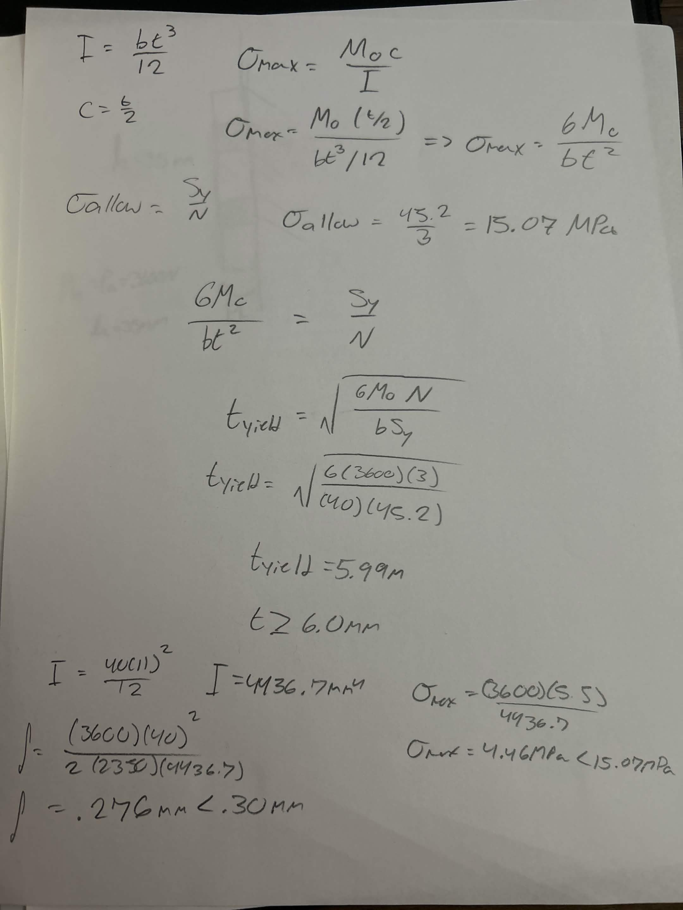

The yield calculation required approximately **6 mm** of thickness, while the deflection calculation required approximately **10.70 mm**. Because deflection controlled the design, I selected a final thickness of:

**11 mm**

The calculated final deflection was approximately **0.276 mm**, which is below the maximum allowable deflection of 0.30 mm.

---

# Feature 2

## Free Body Diagram and Calculations

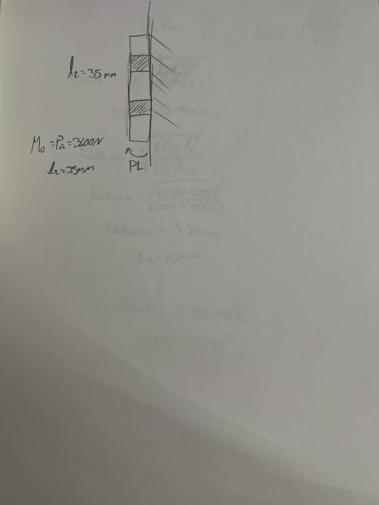

Feature 2 was modeled as the cantilevered portion of the mount attached to rigid wall A. An effective length of 35 mm was used.

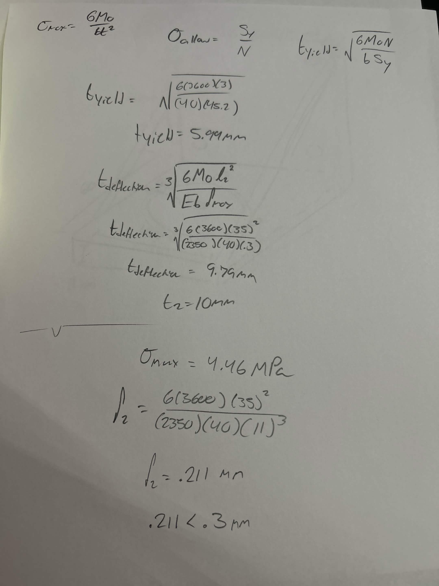

Feature 2 required approximately **10 mm** of thickness based on deflection. Since Feature 1 already required 11 mm, I used a uniform **11 mm thickness** throughout the mount.

The calculated deflection for Feature 2 was approximately **0.211 mm**, which is below the 0.30 mm limit.

---

# Isometric Design Sketch

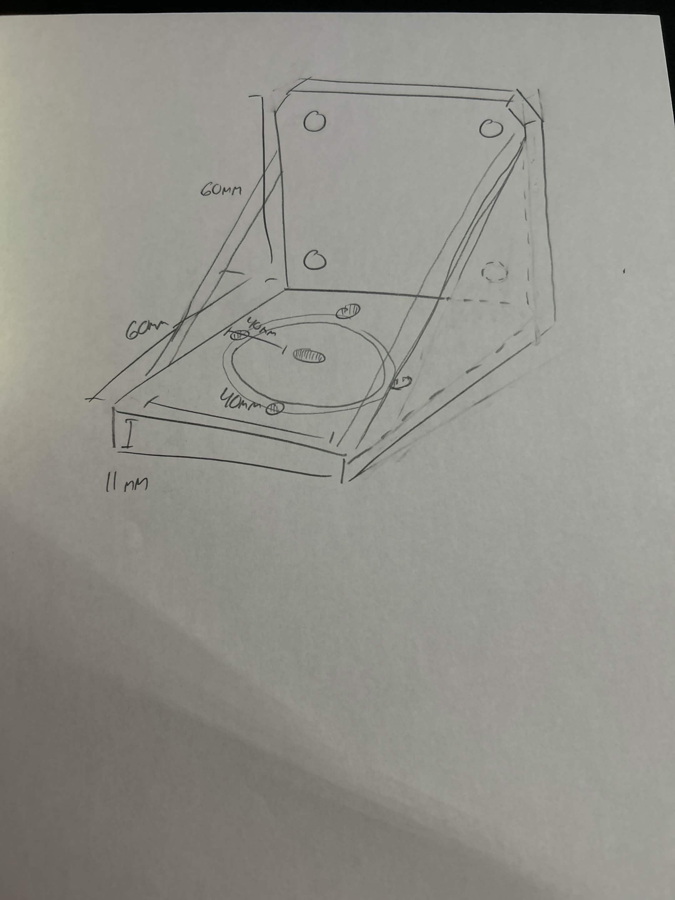

The design consists of a 60 mm horizontal feature and a 60 mm vertical feature with a width of 40 mm and a thickness of 11 mm. The sketch also includes the motor mounting holes, wall mounting holes, and reinforcing gussets.

---

# CAD Model - Parametric

The final motor mount was modeled in **Onshape**.

## Parametric Setup

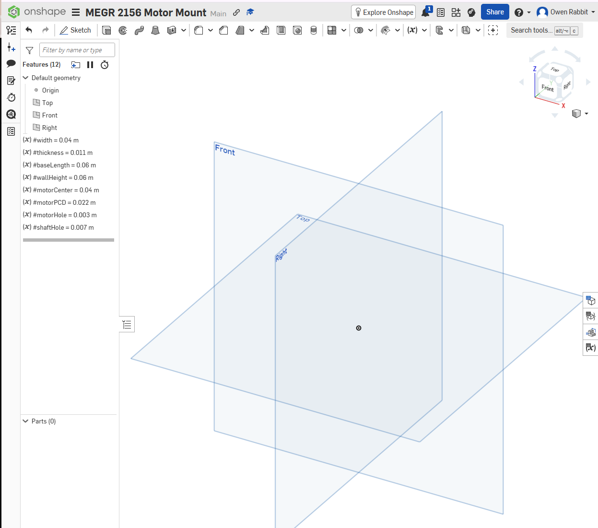

I created variables for the main dimensions of the motor mount, including width, thickness, base length, wall height, motor position, bolt-circle diameter, motor hole size, and shaft hole size. This allowed important dimensions to be changed parametrically.

---

## Main Profile

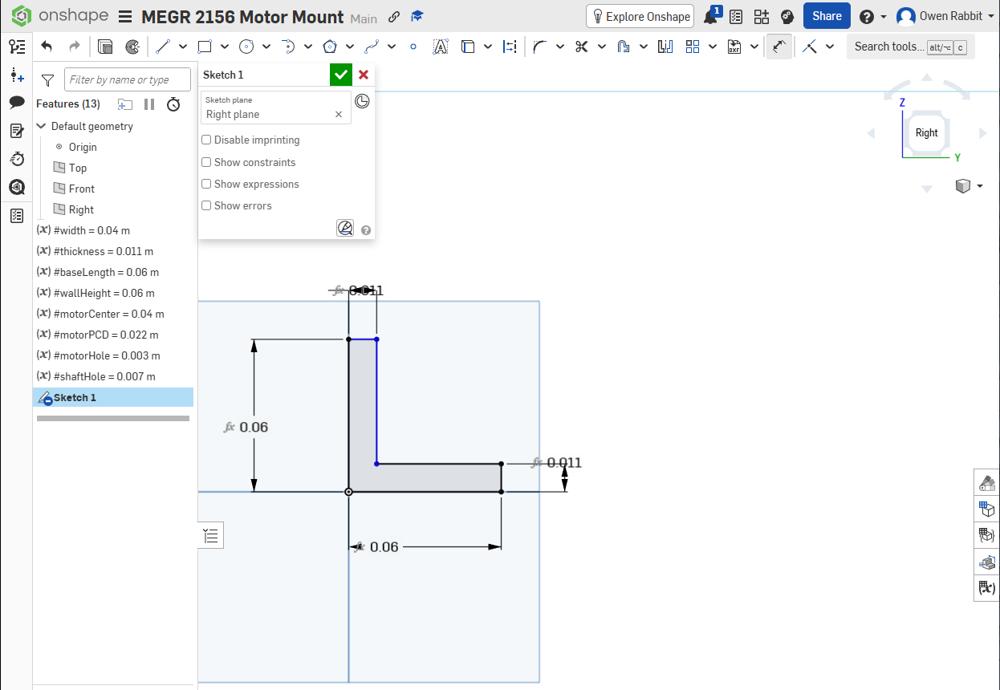

The main profile was created on the Right plane. Both the horizontal and vertical features were designed with an overall length of 60 mm and the calculated 11 mm thickness.

---

## Main Extrusion

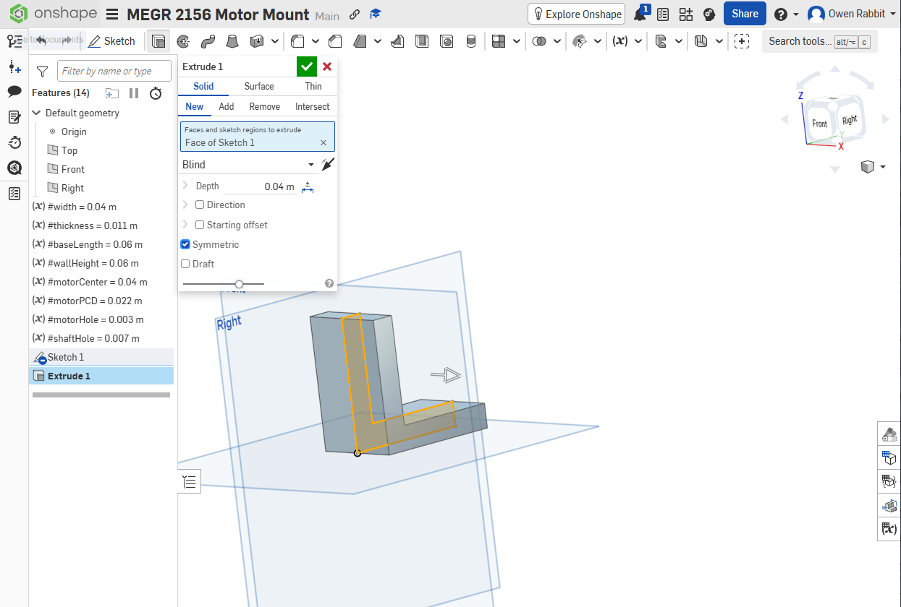

The L-shaped profile was symmetrically extruded to a total width of 40 mm, creating the main structure of the motor mount.

---

# Motor Mounting Holes

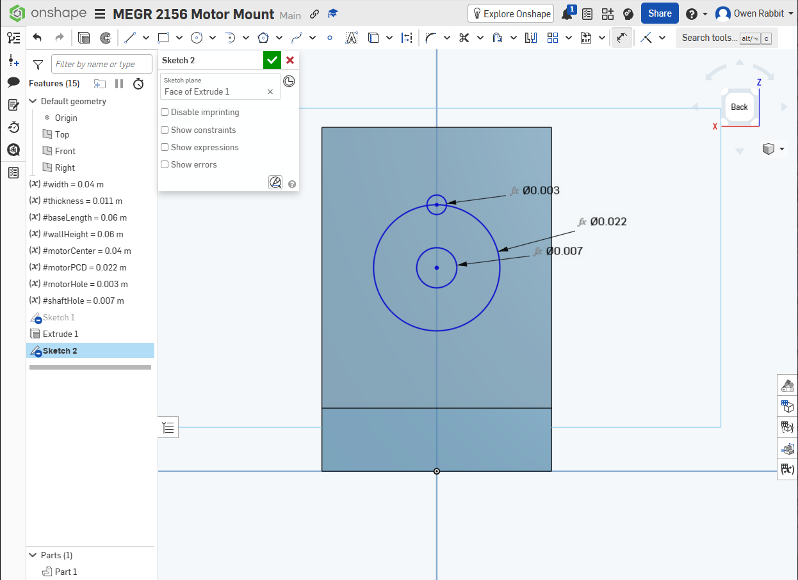

The motor mounting geometry was created using a central shaft-clearance hole and a 22 mm bolt circle. The four bolt clearance holes were designed for the required motor mounting locations.

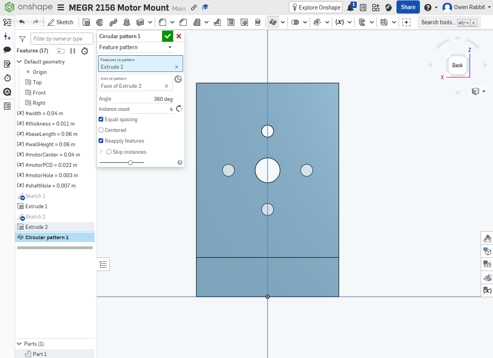

For this portion of the model, I successfully used a **circular pattern** to produce the four equally spaced motor mounting holes.

---

# Wall Mounting Holes

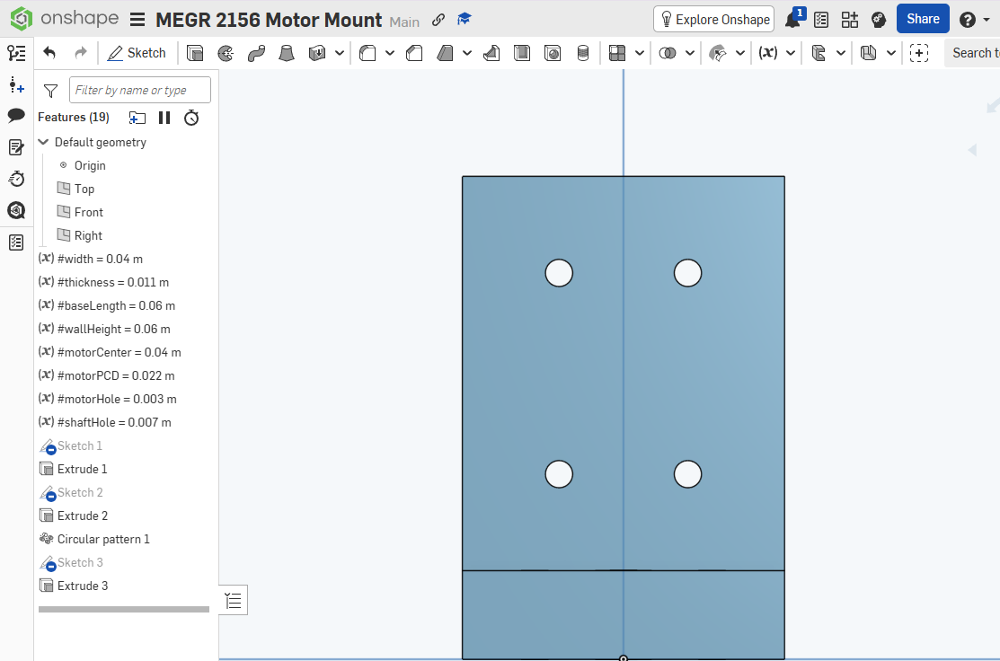

Four wall mounting holes were added to the vertical feature. I did **not** use another pattern for these holes. After having difficulty using patterns later in the model, I created the remaining geometry directly instead.

---

# Deflection-Minimizing Features

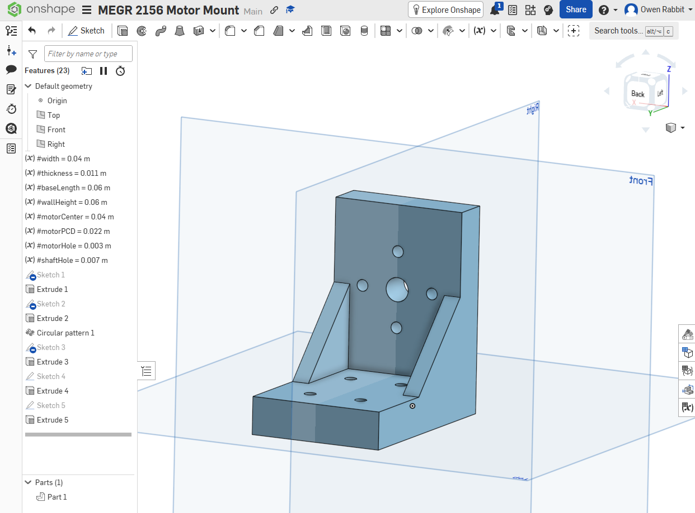

Two reinforcing gussets were added between the horizontal and vertical portions of the bracket to increase stiffness and reduce deflection at the corner.

I did not use a mirror or pattern to create the gussets. Each was created separately after I had difficulty getting the repeated-feature tools to work the way I wanted.

---

# Final CAD Model

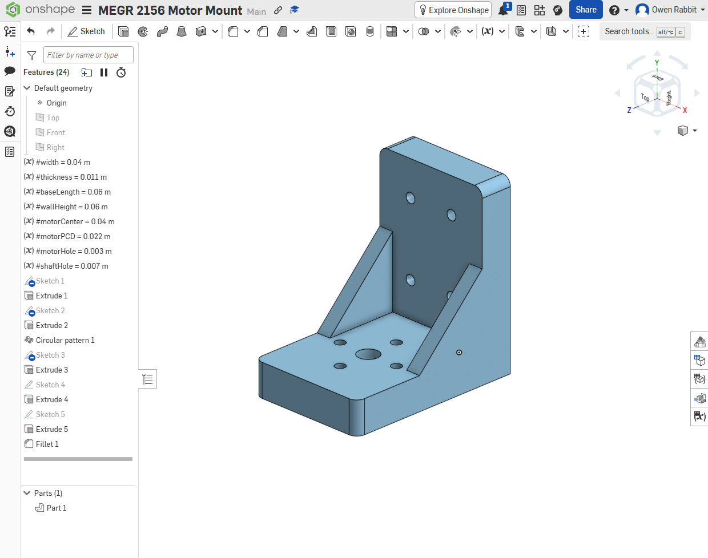

The completed mount includes the motor mounting holes, shaft clearance, wall mounting holes, reinforcing gussets, and newly added edge fillets in unnecessary corners to save material and smoothen the finished result.

---

# Difficulties Encountered

The main difficulty I encountered was using some of the pattern and mirror tools in Onshape. The circular pattern worked well for the motor mounting holes, but I had more difficulty using similar methods later in the model.

Instead of spending excessive time troubleshooting those operations, I found compromises by creating the remaining holes and gussets separately. This still produced the intended final geometry.

---

# Time Spent

The assignment took approximately **3 hours total**.

- **2 hours** designing the mount, completing the handwritten calculations, and creating the CAD model.
- **1 hour** compiling the images and documentation.

---

# Lessons Learned

The main thing I learned from this assignment was how useful pattern tools can be for repeated geometry. The circular pattern made the motor mounting holes much faster and ensured that they stayed evenly spaced.

I also learned that patterns and mirrors can sometimes be difficult to apply depending on the geometry. When I had trouble using them later in the model, finding a simpler compromise allowed me to finish the design without changing the intended result.

I also saw that **deflection controlled the design more than yield strength**, since the required thickness increased from about 6 mm based on yielding to 11 mm based on stiffness.

---

# CAD File

[Download Motor Mount CAD File](https://drive.google.com/file/d/1dgF5FyQKgVDEeiyeLybpUoMEWpcFpO0k/view?usp=sharing)

[View Onshape Model](https://cad.onshape.com/documents/4e522e97aa1d706c27db0c90/w/8e0aed5a95dab14cb343562f/e/8f47933f7e1da870237f70cb?renderMode=0&uiState=6aa8e476404b6537c94c56a1)

---

[Sources and AI Policy]

*Open AI's ChatGPT was used in the making of this for formatting, and organizational purposes. All models, handwritten equations, and text has been handwritten by myself without the use of AI. Research of terminology was used through Google. Grammatical structure was completed with the assistance of Grammarly.*
