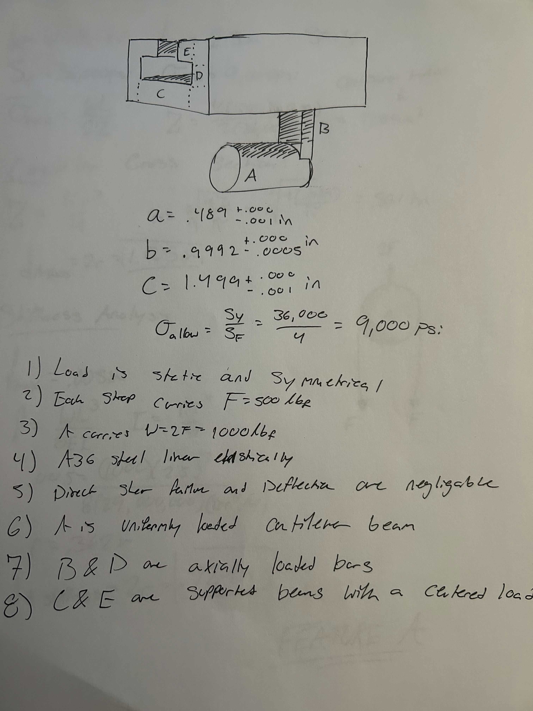
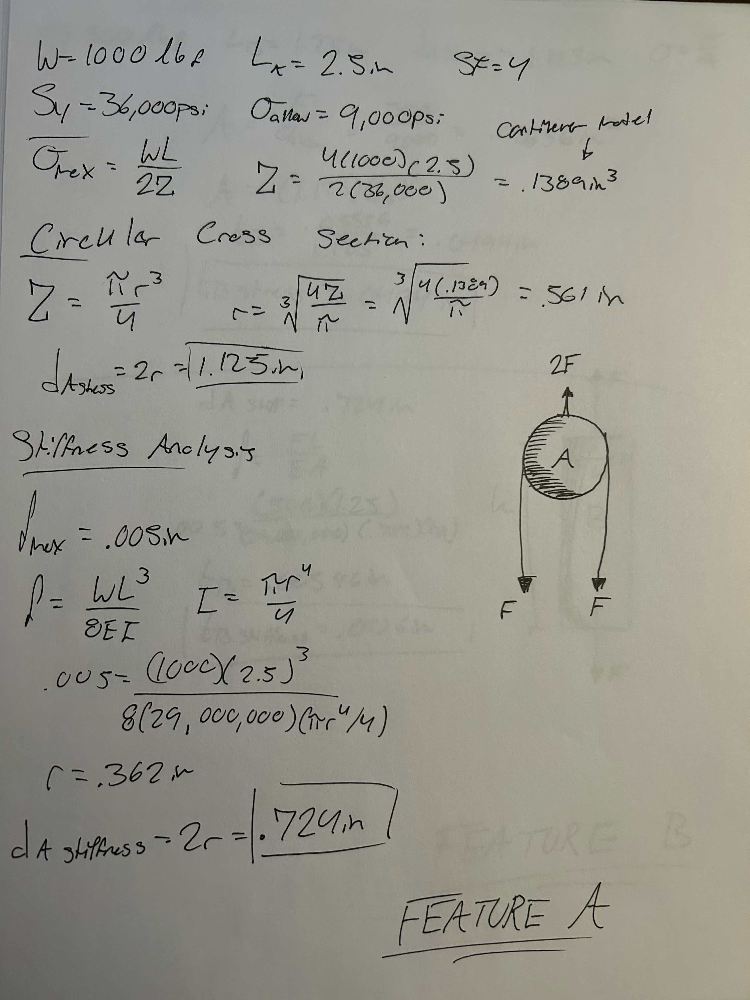
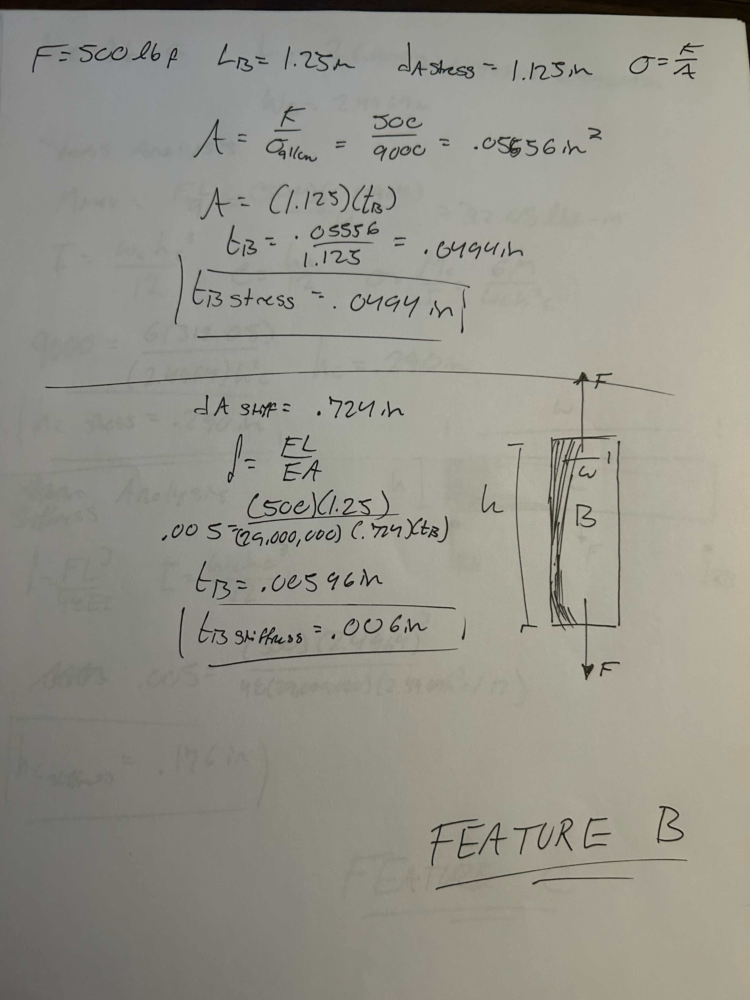
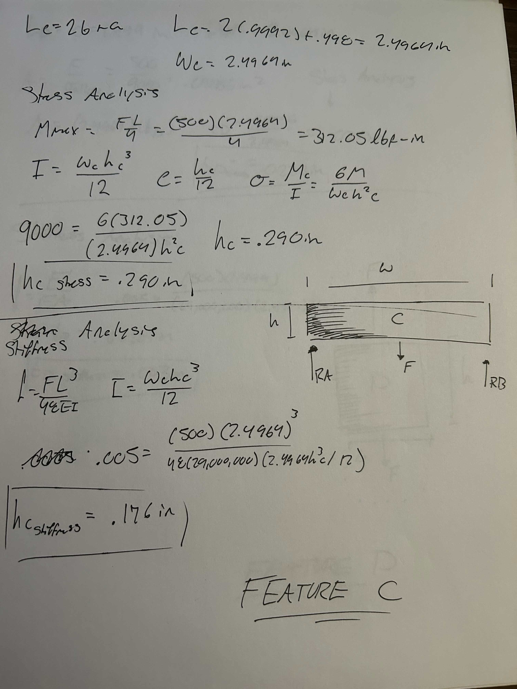
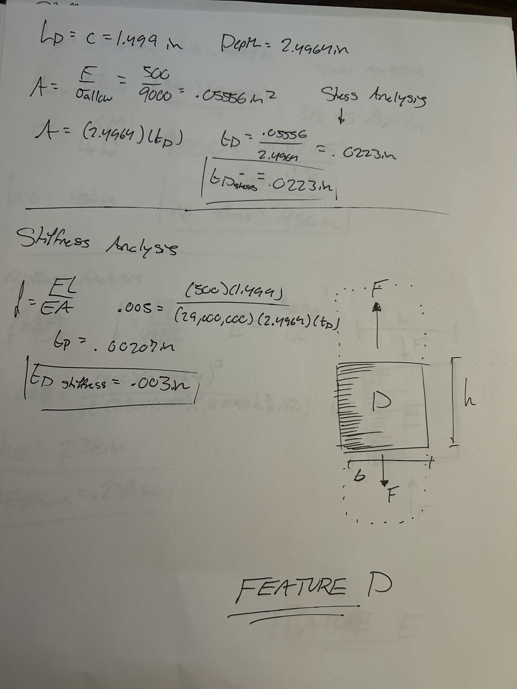
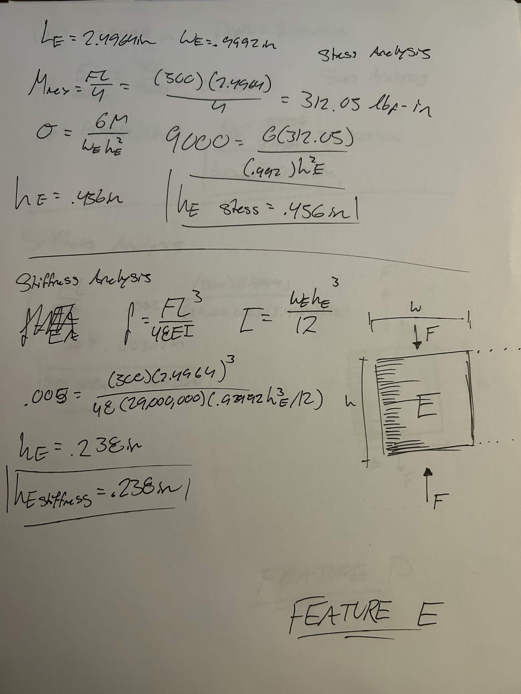
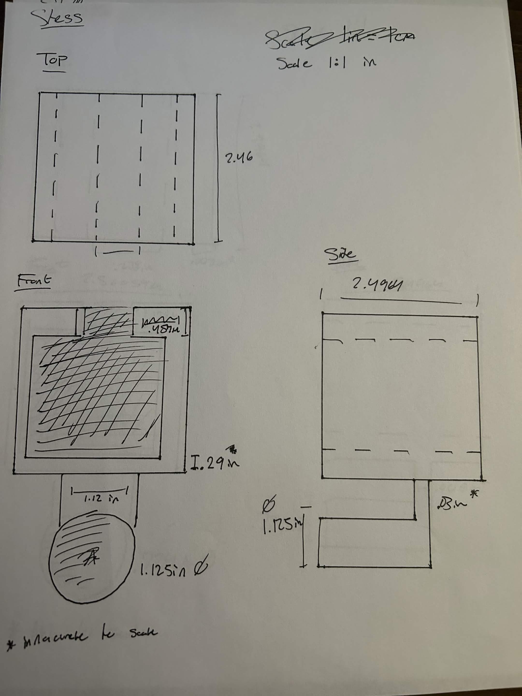
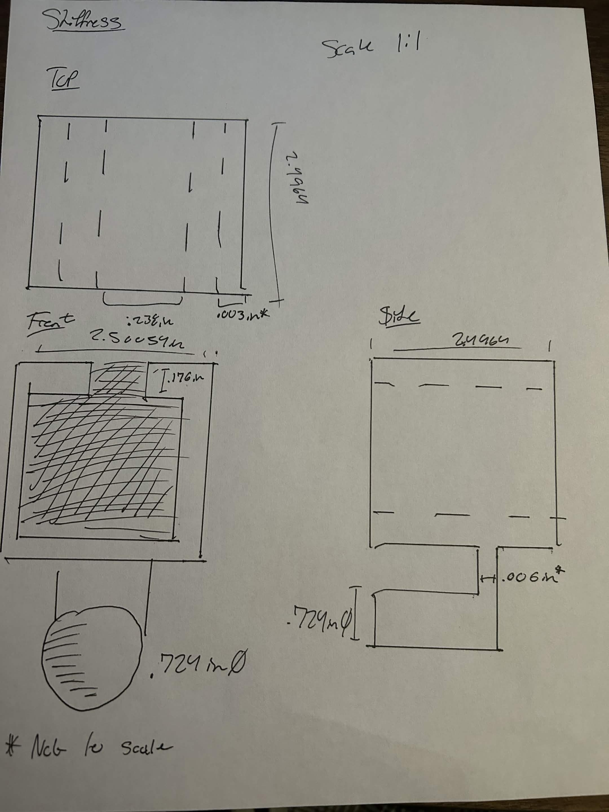

# A5 – [Bracket Design]

## Objective

This assignment designed a bracket that holds a polyester strap around a rigid T beam. I selected ASTM A36 steel because it has a high yield strength and elastic modulus. I used a 500 lbf load on each strap leg, a safety factor of 4, and a maximum deflection of 0.005 in. Direct shear failure and shear deflection were neglected.

## Feature A

Feature A is the cylindrical support that holds the polyester strap. The two strap legs apply a combined load to this feature, so it is the first feature in the load path. I modeled it as a cantilever beam with a distributed load across its length. The stress calculation finds the diameter needed to prevent bending failure, while the stiffness calculation finds the diameter needed to limit deflection. The larger result from the two calculations is the required final diameter.

## Feature B

Feature B is the vertical member that connects the cylindrical strap support to the rest of the bracket. It carries the load from Feature A upward into the main body of the bracket. Since the load acts along its length, I modeled Feature B as an axially loaded bar. The stress calculation finds the minimum cross-sectional area needed to prevent yielding. The stiffness calculation checks how much the feature elongates under the applied load.

## Feature C

Feature C is the lower horizontal member inside the T beam slot. It supports the lower side of the rigid T beam and transfers the applied load across the width of the bracket. I modeled it as a simply supported beam with a centered load because the force acts between two supported ends. The bending moment is largest at the center, so that location controls the required thickness. The deflection calculation checks how much the middle of the feature moves under the same load.

## Feature D

Feature D is the vertical contact member inside the T beam slot. It transfers load between the upper and lower horizontal bracket members. I modeled it as an axially loaded bar because the force acts through its length. The stress calculation uses the cross-sectional area to find the smallest thickness that prevents yielding. The stiffness calculation checks the small amount of shortening caused by the applied load.

## Feature E

Feature E is the upper horizontal member inside the T beam slot. It supports the top side of the rigid T beam and completes the load path into the bracket. I modeled it as a simply supported beam with a centered load, similar to Feature C. The stress calculation determines the required height from the largest bending moment. The stiffness calculation checks the amount of bending deflection at the center of the feature.

## Multiview Sketches

### Stress Analysis Sketch

This sketch shows the bracket dimensions found from the stress calculations. Each feature uses the minimum size needed to keep the stress below the allowable stress for A36 steel. The front, top, and side views show the overall shape of the bracket and how it fits around the rigid T beam. These dimensions are useful for comparing the final design to the stiffness-based design.

### Stiffness Analysis Sketch

This sketch shows the bracket dimensions found from the stiffness calculations. Each feature uses the minimum size needed to keep deflection below 0.005 in. The same front, top, and side views show how the stiffness-based dimensions change the bracket geometry. Comparing this sketch with the stress sketch shows which requirement controls each feature.

## Reflection

Stress governed the final dimensions of the bracket. Feature A showed this most clearly. The stress calculation required a 1.12 in diameter, while the stiffness calculation required a 0.724 in diameter. Stress controlled the final diameter by about 0.40 in.

The result from Feature A carried into Feature B. I used the stress diameter from Feature A in the stress calculation for Feature B and the stiffness diameter in the stiffness calculation for Feature B. Keeping the two paths separate prevented an incorrect downstream value.

I assumed that Feature D had a depth equal to the bracket width. If that depth were smaller, the available contact area would decrease. The required thickness of Feature D would then increase.

This assignment showed me how a design must follow the load path from one feature to the next. I also learned that stress and stiffness can produce different required dimensions, so both checks are necessary.

## Time Spent

I spent 3 hours on calculations. I spent 20 minutes on the multiview sketches. I spent 1 hour compiling the work into GitHub. The total time was 4 hours and 20 minutes.

--
# Disclaimer regarding AI Usage

AI was used in the formatting and organization of this assignment. All handwritten calculations and diagrams were created without AI. Grammar fixes and sentence structure was done with the assistance of Grammarly.
