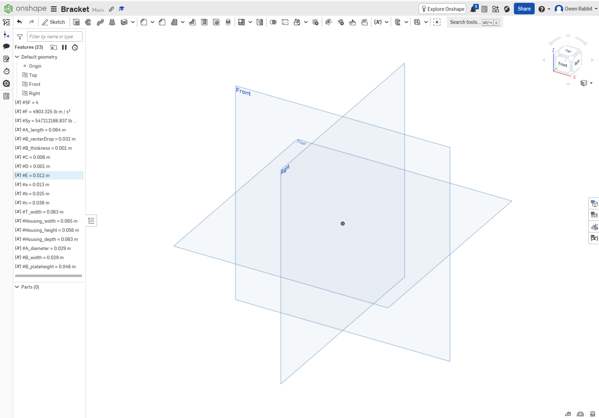
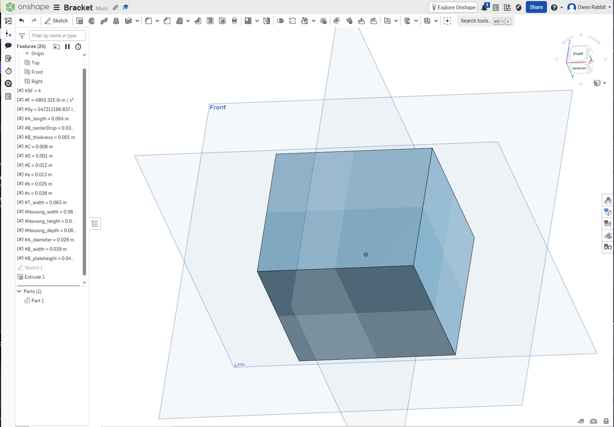
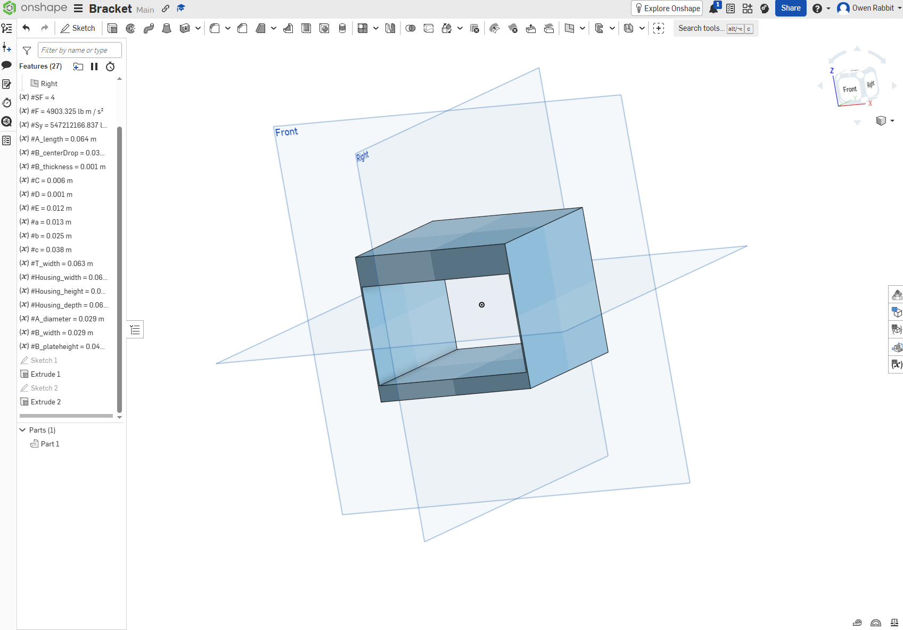
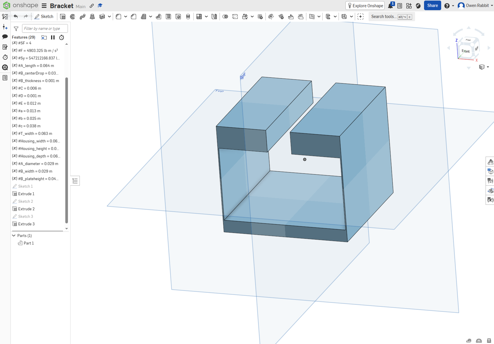
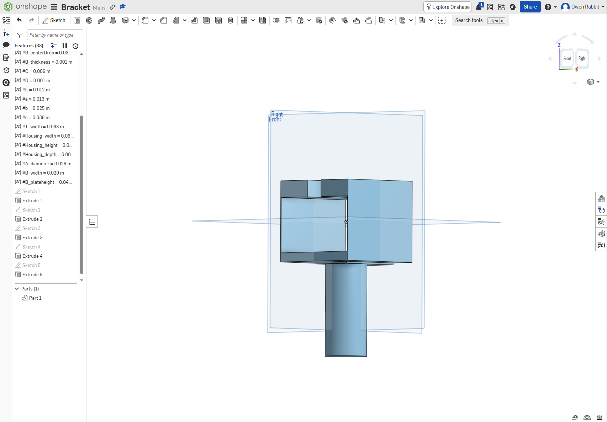
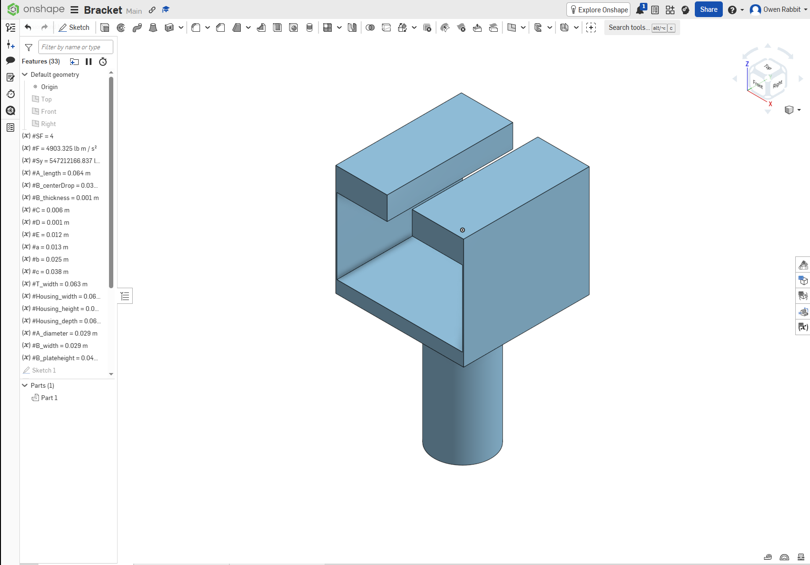
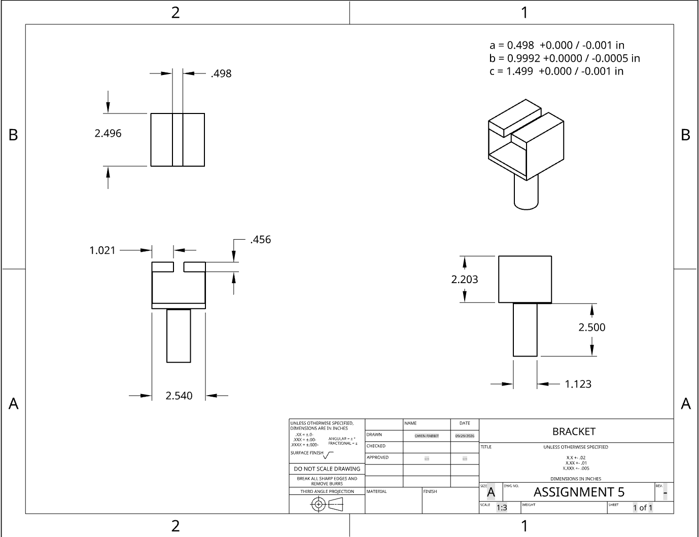

# A6 – [Bracket Drawing (Part 1)]

## Objective

The purpose of this assignment was to convert the bracket designed in the previous strength and stiffness assignment into a parametric CAD model. The bracket was modeled in Onshape using the dimensions determined from the previous stress analysis. A fully dimensioned third-angle engineering drawing was then created with fit tolerances for the rigid T beam.

ASTM A36 steel was used as the basis for the design. The bracket was designed around the three required sliding-fit dimensions of the rigid T beam.

## Parametric Design

I began by entering the important design dimensions as variables in Onshape. This allowed the dimensions from the previous strength analysis to directly control the geometry of the CAD model instead of manually entering unrelated dimensions into each sketch.

The main variables included the T beam dimensions, housing dimensions, Feature A diameter, Feature B dimensions, and the dimensions for Features C, D, and E.

The main housing was created first as a rectangular solid. Its width, height, and depth were controlled using the variables established at the beginning of the model.

A rectangular opening was then removed from the housing to create the primary cavity for the rigid T beam. The dimensions of this opening were based on the required T beam geometry, while the surrounding material represented the structural features sized during the previous assignment.

The upper portion of the cavity was removed to create the T-shaped sliding interface. This produced the two upper sections of the bracket and the central opening required for the stem of the rigid T beam.

Feature B was added underneath the housing as the connection between the main bracket and Feature A. Its dimensions were tied to the variables from the previous analysis so that changes to the controlling dimensions could propagate through the model.

.PNG)

Feature A was then created as the cylindrical support for the polyester strap. Its center location was based on the distance used during the Feature B analysis, while its diameter was controlled by the strength equation used in the previous assignment.

The final model combines the T beam housing, the structural members represented by Features C, D, and E, Feature B, and the cylindrical Feature A into one solid bracket.

## Analytical Equation in CAD

Feature A was selected as the dimension directly controlled by an analytical equation. In the previous assignment, Feature A was modeled as a cantilever beam and bending stress governed its required diameter.

The diameter was expressed directly in Onshape using the bending-strength relationship rather than manually typing the previously calculated diameter. The equation used was based on the applied load, safety factor, cantilever length, and yield strength:

`d = ((32 * SF * F * L) / (pi * Sy))^(1/3)`

This equation produced a Feature A diameter of approximately 1.12 in. Because the sketch references this variable, changing one of the inputs to the equation causes the diameter and dependent geometry to update automatically.

## Engineering Drawing

A multiview engineering drawing was created from the completed model using third-angle projection. Front, top, and side views were included along with an isometric view to clearly communicate the bracket geometry.

The drawing includes dimensions for the overall housing, Feature A, Feature B, and the T beam interface. The required general tolerance block was also included.

## Tolerances

The three dimensions associated with the rigid T beam are functional mating dimensions because they control how the bracket slides over the beam. The required fit dimensions were:

- `a = 0.498 +0.000 / -0.001 in`
- `b = 0.9992 +0.0000 / -0.0005 in`
- `c = 1.499 +0.000 / -0.001 in`

These dimensions require tighter control because excessive variation could either prevent the bracket from fitting over the T beam or create excessive clearance between the two components.

The general tolerance block used on the drawing was:

`X.X ± .02`

`X.XX ± .01`

`X.XXX ± .005`

A dimension such as an overall exterior dimension can use a looser tolerance because it does not directly control the sliding interface. Applying the tightest tolerance to every non-critical feature would unnecessarily increase manufacturing difficulty and cost without improving the function of the bracket.

## Design Process

The model was constructed by first defining the variables and then creating the outer housing. Material was removed to form the main T beam cavity and the smaller upper opening. Feature B was then added beneath the housing, followed by the cylindrical Feature A.

Using variables made it easier to maintain the relationships between the dimensions. Instead of rebuilding geometry when a value changed, the related features could regenerate based on the updated parameter.

## Mistakes and Adjustments

One adjustment during modeling involved properly locating Feature A relative to Feature B. The center of the cylindrical feature needed to be referenced from the connection between Feature B and the main housing rather than from the lower edge of Feature B. Correcting this reference maintained the same load-path dimension used in the previous analytical model.

The feature order also required attention because the T-shaped opening needed to be created before the lower support and cylindrical feature were added. Keeping the model organized in this order made later features easier to position and modify.

## Lessons Learned

This assignment demonstrated how analytical calculations can be carried directly into a parametric CAD model. A calculated dimension is more useful when it remains connected to the variables and equations that produced it because design changes can automatically propagate through the model.

I also learned that tolerances should be selected according to the function of the feature rather than applying the same precision everywhere. The T beam interfaces require tight tolerances because they control the sliding fit, while non-critical exterior dimensions can use larger tolerance ranges without affecting the function of the bracket.

Creating the engineering drawing also showed the importance of selecting views that communicate different parts of the geometry. The third-angle views provide the dimensions needed for manufacturing, while the isometric view makes the overall shape easier to understand.

## Time Spent

I spent approximately 2 hours creating the parametric model and engineering drawing in Onshape. I spent another 1 hour organizing the images, documenting the process, and compiling the assignment into GitHub.

The total time spent on the assignment was approximately 3 hours.

## CAD Download

[Download Bracket OnShape File and Drawing](https://drive.google.com/drive/folders/1vx22M3warD9f-V7tWdSivsqSOmH_vnAy?usp=sharing)
[View Onshape Part](https://cad.onshape.com/documents/c7fb525f3044bad3a86923b3/w/4980922cf18a1775be701a4f/e/ca9c0c25a5aa52cdaa822ca6?renderMode=0&uiState=6abb38b5139db12ef3047496)

--

**Disclaimer regarding AI Usage**

AI was used in the formatting and organization of this assignment. All handwritten calculations and diagrams were created without AI. Grammar fixes and sentence structure was done with the assistance of Grammarly.

